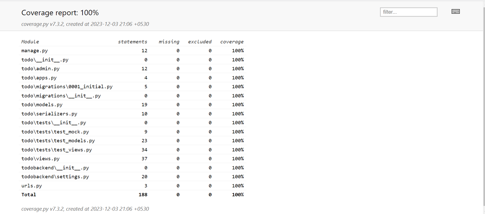

# Todo App Backend API

Welcome to the ToDo App API documentation! Here you will find the necessary steps to get started with this API on your local machine.

## Getting Started

### Prerequisites

Make sure you have the following installed on your system:

- Python 3.7 or higher
- Django 2.2 or higher
- Django Rest Framework 3.11 or higher

### Installation

1. Clone the repository:
``` bash 
git clone https://github.com/username/myapp.git 
```

2. Navigate to the project directory:
``` bash
cd ToDoBackend-Django
```

3. Install pipenv for virtual environment

``` bash
pip install pipenv
```


4. Activate the virtual environment:
```bash
pipenv shell
```


5. Install the required packages:
``` bash
pip install -r requirements.txt
```


## Running the API

1. Run the migrations to create the necessary database tables:

    ```bash
    python manage.py migrate
    ```

2. Start the development server:

    ```bash
    python manage.py runserver
    ```

3. Access the API at [http://localhost:8000/](http://localhost:8000/)

### Testing

To run tests, use the following command:

```bash
python manage.py test todo.tests
```

```bash
python manage.py test todo.testIntegration
```

### Coverage Test ScreenShort


### Thank You


